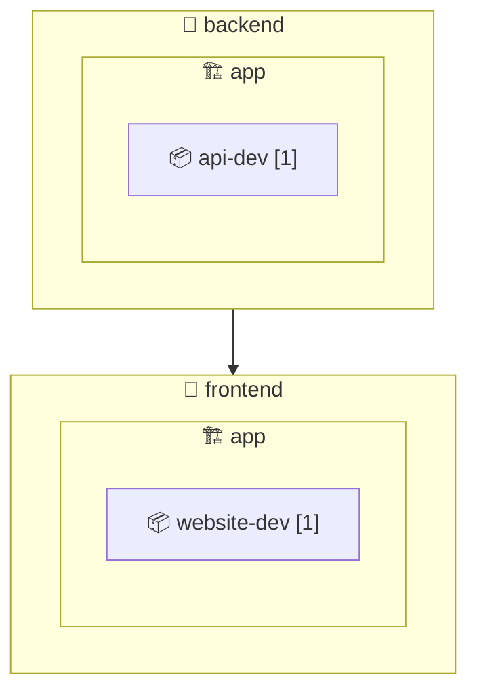

```mermaid
graph TD
    subgraph Wave0["🌊 backend"]
        subgraph Wave0Stage0["🏗 app"]
            Stackbackend_app_api_dev["📦 api-dev [1]"]
        end
    end
    subgraph Wave1["🌊 frontend"]
        subgraph Wave1Stage0["🏗 app"]
            Stackfrontend_app_website_dev["📦 website-dev [1]"]
        end
    end
    Wave0 --> Wave1
```
