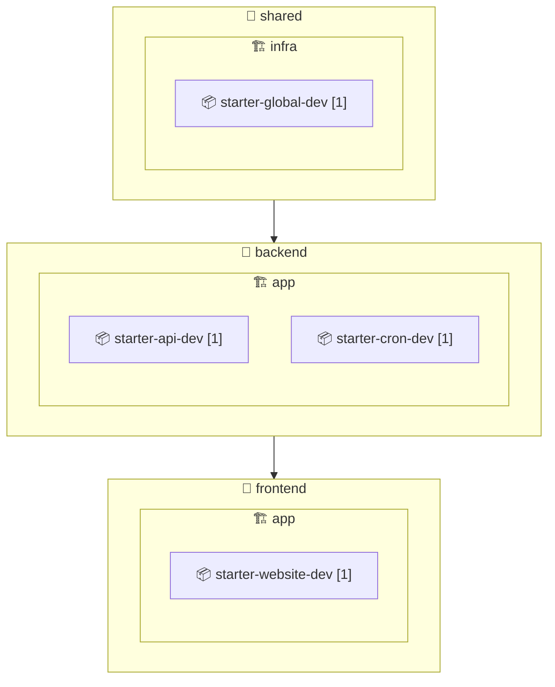

```mermaid
graph TD
    subgraph Wave0["🌊 shared"]
        subgraph Wave0Stage0["🏗 infra"]
            Stackshared_infra_starter_global_dev["📦 starter-global-dev [1]"]
        end
    end
    subgraph Wave1["🌊 backend"]
        subgraph Wave1Stage0["🏗 app"]
            Stackbackend_app_starter_api_dev["📦 starter-api-dev [1]"]
            Stackbackend_app_starter_cron_dev["📦 starter-cron-dev [1]"]
        end
    end
    subgraph Wave2["🌊 frontend"]
        subgraph Wave2Stage0["🏗 app"]
            Stackfrontend_app_starter_website_dev["📦 starter-website-dev [1]"]
        end
    end
    Wave0 --> Wave1
    Wave1 --> Wave2
```
